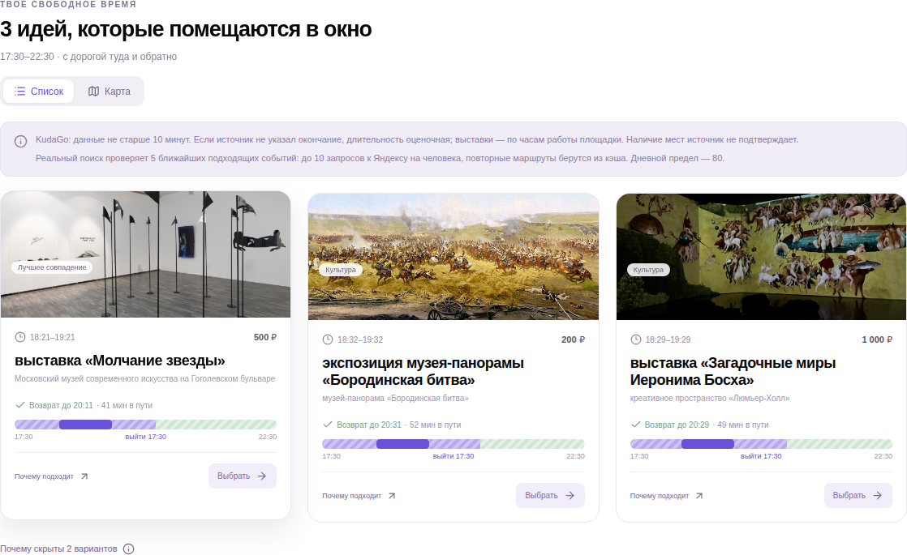
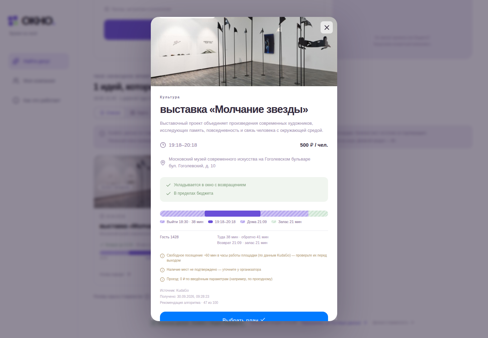

# ОКНО · Свободное окно в MAX

Подбирает досуг в Москве под свободное время, бюджет, интересы и дорогу **туда и обратно**. Один человек или компания до пяти участников получают выполнимый план, объяснение выбора, ссылку на источник и Яндекс Карты.

Репозиторий: https://github.com/Niafon/free-window-max · бот: https://max.ru/t398_hakaton_max_bot

**Статус:** MVP развёрнут на VPS: https://77-91-95-175.sslip.io (`/health`, `/docs`). Чат-бот работает через webhook. Открытие мини-приложения кнопкой из MAX требует привязки этого HTTPS-адреса в кабинете бота на платформе MAX для партнёров; до неё mini app открывается в браузере по тому же адресу сразу, без ввода имени, кода или пароля (гостевая сессия создаётся автоматически).

## Как это выглядит на реальных данных

Снимки боевого сервера: реальный подбор по событиям KudaGo (с их фото) и времени в пути Яндекс Матрицы расстояний туда и обратно. Сняты автоматически workflow [`screenshots.yml`](.github/workflows/screenshots.yml) скриптом [`scripts/screenshots.mjs`](scripts/screenshots.mjs).

| Выдача | Карточка события |
|---|---|
|  |  |

## Запуск одной командой

Нужны Git и Docker Engine с Compose 2.24.4+ (в Windows — запущенный Docker Desktop). Из корня репозитория:

```sh
docker compose up -d --build
```

Открыть http://localhost:3000 — сервис сразу доступен, ничего вводить не нужно. Команда собирает React и API, запускает PostgreSQL/PostGIS, создаёт таблицы и поднимает приложение. Секреты для демонстрации не нужны. Данные хранятся в Docker volume.

| Адрес/порт | Назначение |
|---|---|
| `127.0.0.1:3000` | Интерфейс и API |
| `/health` | Доступность приложения и БД |
| `/docs`, `/openapi.json` | Swagger UI и OpenAPI 3.0.3 |
| `db:5432` | PostgreSQL внутри Docker; наружу не публикуется |
| `5173` | Только отдельный Vite dev server |
| `80/443` | Только будущая VPS с HTTPS |

Остановка: `docker compose stop`. Повторный запуск: `docker compose up -d`. Пересборка после обновления: `docker compose up -d --build`. Журнал: `docker compose logs --tail 100 app`. `docker compose down` сохраняет БД; **не добавляйте `-v`, если данные нужны**.

## Сценарии и проверка

Все часы в интерфейсе — московские. Если сегодняшний вечер прошёл, выбрать завтра.

1. Открыть приложение (из MAX или в браузере — входа нет). По умолчанию включены **тестовые данные**: над формой плашка «Тестовые данные» и кнопка «Перейти к реальным событиям» (KudaGo + Яндекс Маршруты, активна при заданном `YANDEX_MAPS_KEY`; в реальном режиме там же виден остаток дневного лимита маршрутов). Выбрать 18:30–21:30, 1 000 ₽, дорогу 30 минут, МИРЭА на Вернадского. Нажать «Найти варианты». Ожидаются подходящие карточки, у каждой цена, время и возврат. Тестовые данные явно отмечены: плашка «Тестовые данные» над формой, пояснение в выдаче, метка «ТЕСТ» на карточках. Выбранные интересы («Чего хочется») — фильтр: показываются только события этих категорий; если таких нет, выдача предлагает «Показать все категории».
2. Открыть «Вечер настольных игр», посмотреть причины и дорогу, выбрать план, нажать «Забронировать» — для тестовых данных появится сообщение «Перенаправлено на страницу бронирования» с меткой «ТЕСТ» (место не резервируется, данные никуда не отправляются); у реального события кнопка «Забронировать на сайте события» открывает его страницу KudaGo с билетами и регистрацией (в MAX — через `WebApp.openLink`). Поставить оценку, скопировать ссылку. Карточка по ссылке доступна 24 часа; она не раскрывает личную точку старта и участников.
3. Установить дорогу 5 минут. Ожидается понятное пустое состояние и рассчитанные изменения условий. Новые ограничения применяются только после нажатия пользователя.
4. Нажать «С друзьями», создать компанию и сохранить свои параметры. Во втором **отдельном профиле/приватном окне** (это отдельный гость) открыть приглашение, присоединиться и сохранить бюджет 500 ₽. Для локальной проверки без настроенного MAX используйте `http://localhost:3000/?session=<UUID компании>`; настроенная VPS формирует приглашение через MAX.
5. У первого участника дождаться двух готовых участников (до 5 секунд), нажать «Найти общее окно». Каждое предложение проходит ограничения обоих; общий подбор и выбор делает создатель. Изменение параметров аннулирует прежний подбор.
6. Бот понимает запрос текстом без LLM: «сегодня после пар на 2 часа до 1000, не кино, не дальше 30 минут» — извлекает окно, бюджет, дорогу, интересы и исключения, недостающее спрашивает кнопками. Кнопочный путь: `/start` → окно (прямо сейчас, сегодня/завтра вечером или своё: «завтра 19:00–22:00», «02.10 18:00–21:00») → бюджет (кнопки или своя сумма) → точка старта (геопозиция при подключённом Яндексе либо точка из списка) → дорога → интерес → карточки с маршрутом и источником → «Иду» → план, Яндекс Карты, «Позвать друга». «🎲 Удиви меня» — один из трёх лучших вариантов на ближайшие 2 часа (до 1000 ₽, 30 мин). Через 2 часа после окончания выбранного события бот спрашивает «Удалось сходить?» и просит оценку — метрика «Выход состоялся». Точки из списка работают на учебном наборе, геопозиция — на реальных событиях KudaGo и маршрутах Яндекса. Участники компании получают в чате уведомления: кто присоединился, все готовы, общий подбор готов, выбран план.

Тестовых логинов и паролей нет. В MAX пользователь определяется проверенной подписью `initData`. В браузере без MAX сервер автоматически выдаёт гостевую сессию «Гость NNNN» (подписанная httpOnly cookie на 30 дней); каждый браузерный профиль — отдельный участник. Роли «Аня» (создатель) и «Борис» (участник) в [DATA-API.yaml](DATA-API.yaml) — это имена двух гостевых сессий, созданных через `POST /api/v1/auth/guest`.

### Работа с тестовыми данными

- По умолчанию интерфейс работает на тестовых данных. Переключатель «Перейти к реальным событиям» / «Вернуться к тестовым данным» находится над формой подбора и компании.
- Если реальный источник недоступен или исчерпан дневной лимит маршрутов, сообщение об ошибке предлагает кнопку «Тестовые данные».
- Если `YANDEX_MAPS_KEY` не задан (например, локальный запуск без секретов), кнопка перехода к реальным событиям неактивна.
- Тестовый режим всегда явно обозначен: плашка «Тестовые данные» над формой, пояснение в выдаче, метка «ТЕСТ» на карточке, «Источник: тестовые данные» в подробностях. В API режим задаёт поле `dataMode` (`live` / `demo`); все участники компании должны использовать один режим.

## Данные и внешние сервисы

- **Тестовые данные (по умолчанию):** `demo-data/events.json`, 10 синтетических событий и таблица поездок для четырёх точек. События, цены и длительность пути не выдаются за реальные и помечены. Платных внешних запросов нет.
- **Реальные данные:** KudaGo — реальные события Москвы; Яндекс Матрица расстояний — время поездки общественным транспортом. Включаются кнопкой «Перейти к реальным событиям». Категории KudaGo сопоставляются с интересами ОКНО по категории события и тегам (спорт и еда в KudaGo есть только в тегах).
- Для реальных маршрутов нужно подключить продукт «API Матрицы расстояний», а не API деталей маршрута.
- PostGIS отбирает ближайшие к точке старта (для компании — к центру точек участников) подходящие события выбранных интересов; маршрут считается для `LIVE_CANDIDATES` из них (по умолчанию 5) × 2 направления × число участников. Одинаковые маршруты в пределах часа отправления 6 часов берутся из кэша в памяти и квоту не тратят; общий серверный предел по умолчанию **80 запросов/сутки**. Ключ владельца ограничен 100/сутки. Квота резервируется в PostgreSQL перед каждым запросом, включая неудачные. Поиск может закончиться ошибкой квоты; автоматического переключения на вымышленные маршруты нет — пользователь сам выбирает тестовые данные кнопкой в сообщении или над формой. При 80 запросах/сутки это примерно 4–8 реальных подборов с новыми маршрутами.
- Выбор и открытие сохранённого плана не вызывают Яндекс повторно. Реальные маршруты не сохраняются в БД. После перезагрузки страницы полный live-подбор запускается пользователем заново; общая карточка события остаётся доступна.
- Источник, время получения, неполнота данных и ограничения показаны в карточке. Неизвестные цены/неполное расписание исключаются. Отсутствие подтверждённого наличия билетов обозначается; покупки и бронирования нет.

Подробнее: [источники](docs/data-sources.md), [алгоритм](docs/recommendation.md), [безопасность](docs/security.md).

## Окружение и секреты

Скопировать `.env.example` в `.env`, заполнить только нужные подключения. Настоящие ключи **не коммитить**. `.env` исключён из Git и Docker build context. В локальной папке владельца ключи уже записаны; при клонировании их не будет.

| Переменная | Значение/назначение |
|---|---|
| `HOST`, `PORT` | Локально `127.0.0.1`, `3000`; в контейнере `0.0.0.0`, `3000` |
| `PUBLIC_URL` | `http://localhost:3000`; на VPS реальный HTTPS origin без завершающего `/` |
| `DATABASE_URL` | PostgreSQL URI для запуска без Docker; Compose устанавливает внутренний адрес |
| `POSTGRES_PASSWORD` | Локальный учебный пароль по умолчанию; на VPS заменить случайным hex значением |
| `BOT_TOKEN`, `BOT_USERNAME` | Ключ бота и имя без `@` |
| `MAX_MODE` | `off` / `polling` для локального чата / `webhook` для VPS |
| `MAX_API_URL` | По умолчанию `https://platform-api.max.ru`. У `platform-api2.max.ru` сертификат не проходит проверку в стандартном образе Node |
| `MAX_WEBHOOK_SECRET` | Случайная строка от 32 символов; обязательна для webhook |
| `YANDEX_MAPS_KEY` | Серверный ключ Матрицы расстояний, пустой отключает live |
| `YANDEX_DAILY_LIMIT` | `80`, допустимо 0–100; не увеличивает реальный лимит кабинета |
| `GUEST_AUTH` | `true` по умолчанию: браузер без MAX получает гостевую сессию автоматически. `false` оставляет доступ только из MAX |
| `INIT_DATA_MAX_AGE_SECONDS` | Допустимый возраст подписи MAX (`auth_date`), по умолчанию 3600 — интервал, рекомендованный документацией MAX |
| `TRUST_PROXY_HOPS` | `0` локально, `1` только за единственным Caddy без открытого порта приложения |
| `LOG_LEVEL` | `info`; запросы и ошибки без секретов и тел webhook |
| `EVENT_PROVIDER`, `ROUTE_PROVIDER` | Совместимость конфигурации: demo/kudago и demo/yandex. Фактический режим задаёт `dataMode` запроса; `ROUTE_PROVIDER=yandex` дополнительно проверяет наличие ключа при старте |

При TLS-ошибке подключения MAX исправить доверенные сертификаты/прокси или выбрать официальный поддерживаемый endpoint. Отключать проверку TLS нельзя.

## Архитектура и разработка

React 19 + TypeScript + Vite, MAX UI/Bridge, Zustand и TanStack Query. Fastify на Node.js 22, Zod, Drizzle ORM, PostgreSQL 17 с PostGIS, официальный SDK MAX. Один backend отдаёт UI, API и webhook. Зависимости закреплены в `package-lock.json`. [Схема и модули](docs/architecture.md).

Без Docker: установить Node.js 22 и PostgreSQL 17/PostGIS, создать отдельную БД и `.env`, затем:

```sh
npm ci
npm run build
npm start
```

Для разработки запустить `npm run dev` и отдельно `npm run dev:web`. API работает на 3000, интерфейс на 5173 с проксированием `/api`. Для интеграционных тестов выделить **отдельную БД с именем, заканчивающимся `_test`**: она очищается тестами.

```sh
npm run typecheck
npm test
# Указать TEST_DATABASE_URL для 13 проверок с настоящей PostgreSQL/PostGIS.
npm run build
npm run test:e2e
npm run check:secrets
```

В Linux перед E2E: `npx playwright install --with-deps chromium`; Windows использует установленный Edge. Тесты не расходуют Яндекс. GitHub Actions выполняет unit/integration/E2E и Docker build. Фактические результаты: [VALIDATION.md](docs/VALIDATION.md).

## Материалы сдачи

- [PDF-презентация](docs/presentation.pdf), [сверка с брифом](docs/brief-compliance.md).
- [OpenAPI](openapi.json), [DATA-API.yaml](DATA-API.yaml), [API и тестовые роли](docs/api.md).
- [Шаблон будущей VPS и MAX](docs/deployment.md), [пилот и гипотезы](docs/pilot.md).
- Версию кода фиксирует Git commit; слайд 1 содержит commit реализации. После дедлайна версия должна быть заморожена владельцем. Никакой произвольной даты дедлайна не предполагается.

Публичная презентация не содержит рабочих секретов по прямому требованию владельца. Для закрытой сдачи служебный слайд с действующим HTTPS и переменными окружения формируется локально скриптом `scripts/build-presentation.py --private` после развёртывания. Результат в `private/` исключён из Git; передавать только организаторам закрытым каналом.

## Ограничения

Москва, возраст 18+, до 5 участников, сегодня и 7 следующих дней. Поиск KudaGo ограничен первой страницей до 100 записей, затем до 10 подходящих событий: полнота афиши не обещается. Источник не гарантирует наличие билетов. Гостевая сессия в браузере — подписанная cookie на 30 дней без серверного хранилища; ключ подписи выводится из `BOT_TOKEN`, поэтому сессии переживают перезапуск и масштабирование на несколько экземпляров. Без `BOT_TOKEN` (локально) ключ случайный и после перезапуска браузер молча получает новую гостевую сессию. Гость в браузере не получает уведомлений в чате MAX.

Производительность p95 <4 с — **цель, не измеренный результат нагрузочного теста**. Бюджет 100 обращений к Яндексу не годится для массового пилота. Браузерные проверки не заменяют проверку в реальных мобильном и веб-клиентах MAX. Docker Desktop на машине владельца не запускается из-за ошибки своего служебного канала; локальное выполнение проверено на Node/PostgreSQL, контейнер полностью проверен в GitHub Actions: сборка 22 секунды без загрузки базового образа, запуск и 19 API-проверок успешны. Непрерывная доступность MAX/HTTPS и проверка реальных клиентов обязательны перед сдачей.

Лицензия собственного кода: MIT. Лицензии внешних библиотек и сервисов сохраняют силу; [THIRD_PARTY_NOTICES.md](THIRD_PARTY_NOTICES.md).
