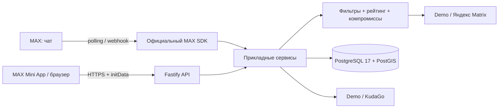

# Архитектура

`apps/web` — адаптивный интерфейс, MAX Bridge, состояния загрузки/ошибки/пустой выдачи. `packages/contracts` — схемы и общий контракт. `apps/api/src/auth` — проверка HMAC и срока MAX initData. `max` — диалог бота и дедупликация обновлений. `providers` — доступ к источникам и нормализация. `search/service` — права, поиск, компании, планы, оценки и квота. `recommendation` — чистые правила расчёта. `db` — схема Drizzle, идемпотентное создание таблиц, уборка по TTL.

Пользователь → поиск → выдача → сохранённый план. Компания хранит участников, индивидуальные параметры и номер ревизии. Изменение параметров сбрасывает результат. Общий поиск сохраняется только при совпадении ревизии; общий выбор разрешён создателю и только из текущего поиска. Присоединение блокирует строку компании, чтобы параллельные запросы не создали шестого участника.

PostGIS ограничивает список радиусом 60 км от первого участника; это предварительный фильтр, не оценка времени дороги. Все участники затем проверяются настоящим выбранным провайдером маршрутов.

VPS: Caddy → приложение → БД, один origin, без CORS wildcard. Начальный размер — 2 vCPU/2–4 GB RAM как гипотеза до измерения. При росте — общая БД, несколько stateless API, внешний store демосессий и кэша KudaGo, миграции отдельным job. Текущий запуск предназначен для одного экземпляра API.

Логи содержат request id, путь без query, время ответа и код ошибки; тела запросов, токены, cookies и координаты не пишутся. Таблица metrics содержит тип действия, серверную длительность поиска и размер выдачи, без MAX id. Просмотр обезличенных агрегатов: `docs/pilot.md`.
